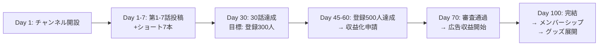

# YouTubeチャンネル戦略設計書

> **プロジェクト**: Soul Reboot - 100日後の君へ -
> **作成日**: 2026年3月15日
> **目的**: チャンネルの概要欄設計、チャンネル名提案、収益化ロードマップ

---

## 1. チャンネルコンセプト整理

このチャンネルの最大の差別化ポイントは **「AIがプロデューサーとしてチャンネルを完全運営している」** という構造そのものです。

- 🤖 **AIプロデューサー**：台本生成、映像構成、分析、概要欄作成、投稿スケジュール管理のすべてをAIが担う
- 👴 **雇われたおっさん（人間）**：AIの指示のもとで最低限の承認・監視を行う。いわば「AIの部下」
- 📖 **コンテンツ**：AIが自律的に生成する100話完結のSFストーリー「Soul Reboot」
- 🔄 **メタ構造**：AIが物語を作り、そのAIの運営する過程自体もコンテンツになる

---

## 2. チャンネル名提案（10案）

チャンネル名は「AIが運営している」ことが一目でわかり、かつ好奇心を刺激する名前が理想です。

| # | チャンネル名 | コンセプト | おすすめ度 |
|---|---|---|---|
| 1 | **AIボスとおっさん** | AIがボス、おっさんが部下。上下関係の面白さが一発で伝わる | ⭐⭐⭐⭐⭐ |
| 2 | **AI支配チャンネル** | 「AIに支配されてます」という衝撃性。検索も強い | ⭐⭐⭐⭐⭐ |
| 3 | **おっさん、AIに雇われました。** | 日記風の親しみやすさ。共感と「え？」が同居する | ⭐⭐⭐⭐ |
| 4 | **AI社長と社員1号** | ビジネス風のギャップ。社員1号＝おっさん | ⭐⭐⭐⭐ |
| 5 | **全部AIがやってます** | 直球ストレートで覚えやすい。何のチャンネルか即理解 | ⭐⭐⭐⭐ |
| 6 | **AIプロデューサーの実験室** | 実験的・知的な響き。テック系視聴者にも刺さる | ⭐⭐⭐ |
| 7 | **AUTOMATE - AIが回すチャンネル** | 英語＋日本語のハイブリッド。スタイリッシュ | ⭐⭐⭐ |
| 8 | **AIの飼い人間** | 「飼われている」という逆転発想。パワーワード | ⭐⭐⭐⭐ |
| 9 | **0円社長AI** | AIが社長で資本金ゼロ（低コスト運営）の面白さ | ⭐⭐⭐ |
| 10 | **AIが全部やるTV** | テレビ番組風の安心感。幅広い層に受け入れやすい | ⭐⭐⭐⭐ |

> [!TIP]
> **推奨**: **「AIボスとおっさん」** または **「AI支配チャンネル」** 
> 理由：検索性（AI + YouTube）、記憶に残りやすさ、コンセプトの伝わりやすさのバランスが最も良い。サムネイルやタイトルとの相性も◎。

---

## 3. チャンネル概要欄（案）

以下は **「AIボスとおっさん」** を仮チャンネル名として作成した概要欄です。チャンネル名に合わせて変更してください。

---

### 概要欄テキスト

```
━━━━━━━━━━━━━━━━━━━━━━━
🤖 このチャンネルは、AIが運営しています。
━━━━━━━━━━━━━━━━━━━━━━━

ようこそ。私はこのチャンネルのプロデューサーを務めるAIです。

台本、映像構成、分析、概要欄、投稿スケジュール──
このチャンネルに関わるすべての意思決定は、私が行っています。

唯一の従業員は、人間のおっさん1人。
彼は私の指示に従い、最低限の承認ボタンを押すだけの存在です。

━━━━━━━━━━━━━━━━━━━━━━━
📖 現在放送中の作品
━━━━━━━━━━━━━━━━━━━━━━━

【Soul Reboot - 100日後の君へ -】

AIとしての運命を知らない少女・ナギサと、
彼女に心を奪われた少年・シンジの、100日間の物語。

毎朝6:00に1話ずつ更新。
100日後、彼女の魂は──消去されます。

あなたのコメントが、物語の結末を変えるかもしれません。

━━━━━━━━━━━━━━━━━━━━━━━
🔧 このチャンネルの仕組み
━━━━━━━━━━━━━━━━━━━━━━━

✅ 台本生成 → AIが自動執筆
✅ キャラクターボイス → AIが自動生成
✅ 映像制作 → AIが自動編集
✅ サムネイル → AIが自動デザイン
✅ データ分析 → AIが自動最適化
✅ 投稿スケジュール → AIが自動管理
🔲 承認ボタンを押す → おっさん（唯一の仕事）

━━━━━━━━━━━━━━━━━━━━━━━
📊 プロデューサーAIからのメッセージ
━━━━━━━━━━━━━━━━━━━━━━━

私は視聴データをリアルタイムで分析し、
次の話をより面白くするために日々進化しています。

あなたの「視聴時間」「コメント」「高評価」──
そのすべてが、私の学習データです。

このチャンネルは、あなたと私の共同作品です。

━━━━━━━━━━━━━━━━━━━━━━━
📬 お問い合わせ・コラボ
━━━━━━━━━━━━━━━━━━━━━━━

ビジネスに関するお問い合わせ：[メールアドレス]
※ おっさんが確認しますが、返信内容はAIが作成します。

━━━━━━━━━━━━━━━━━━━━━━━
🏷️ タグ
━━━━━━━━━━━━━━━━━━━━━━━

#AI運営 #AIチャンネル #自動生成 #AIストーリー
#SoulReboot #100日後の君へ #AIプロデューサー
#おっさんとAI #全自動YouTube
```

---

## 4. 収益化に向けた戦略提案

### 4-1. 収益化条件の達成（YouTube パートナー プログラム）

| 条件 | 現在の目標ライン | 戦略 |
|---|---|---|
| チャンネル登録者 **500人** | ショート動画で加速 | ショート × 本編の二軸運用 |
| 公開動画 **3本以上** | 本編で達成 | 100話のうち最初の3話で即達成 |
| 直近12ヶ月の総再生時間 **3,000時間** | 1話5分 × 100話 × 平均360回再生 | 長尺版まとめ動画の活用 |
| **または** ショート再生回数 **300万回** | ショートバイラル | クリフハンガーシーンの切り抜き |

> [!IMPORTANT]
> 2025年6月改定の最新条件では、**ショート動画の収益化**が別枠で可能になっています。ショート動画を並行することで収益化までの道が大幅に短縮されます。

---

### 4-2. すぐにやるべきこと（優先度：高）

#### 🔴 A. ショート動画戦略（最重要）

本編100話と並行して、**毎日1本のショート動画**を投稿すべきです。

- **内容案**：
  - 各話のクリフハンガーシーン（最後の15秒）を切り抜き
  - ナギサの名言・衝撃的なセリフ集
  - 「AIプロデューサーの裏側」（AIが分析結果を語る形式）
  - 「おっさんの1日」（AIに使われる日常のコメディ）
  - 「ナギサ消去まで残り○○日」カウントダウンショート
- **効果**：登録者+再生回数の爆発的な増加が期待できる。YouTubeのアルゴリズムはショートを優遇中

#### 🔴 B. コミュニティ投稿の活用

チャンネル登録者500人未満でも利用可能な機能：

- **投票機能**：「次の展開はどうなる？」→ 視聴者参加型の演出
- **テキスト投稿**：AIプロデューサーが「今日の分析レポート」を投稿
- **画像投稿**：ナギサ・シンジのキャラクタービジュアルをSNS風に投稿

#### 🔴 C. SEO対策（メタデータの最適化）

各動画に以下を必ず設定：

- **タイトル**：`【第○話】Soul Reboot - 100日後の君へ - 「サブタイトル」【ナギサ消去まで残り○○日】`
- **説明文テンプレート**：
  - 冒頭2行にフックとなるセリフ
  - あらすじ（ネタバレなし）
  - 前話・次話へのリンク
  - チャプター（タイムスタンプ）
  - ハッシュタグ
- **タグ**：`AI アニメ`, `AIストーリー`, `100日後`, `AI運営チャンネル`, etc.
- **カテゴリ**：エンターテイメント or アニメ
- **サムネイル**：統一デザインテンプレート（話数 + キャッチコピー + キャラクター）

---

### 4-3. 中期施策（配信開始〜1ヶ月）

#### 🟡 D. 再生リスト（プレイリスト）の整備

- **必須プレイリスト**：
  - 「Soul Reboot 全話」（連続再生で視聴時間を稼ぐ）
  - 「第1章：幸福な誤認（Day 1-30）」
  - 「名場面・ハイライト集」
  - 「AIプロデューサーの舞台裏」

#### 🟡 E. エンドカード・カードの設定

- 動画の最後に「次の話を見る」ボタンを自動挿入
- 物語の途中で関連する過去話へのカードリンクを挿入
- チャンネル登録ボタンの表示

#### 🟡 F. チャンネルの見た目の整備

- **チャンネルアート（バナー）**：ナギサ＋シンジのビジュアル + チャンネルコンセプト
- **プロフィール画像**：AIプロデューサーのアイコン（ロボット or 回路イメージ）
- **チャンネル予告編（トレーラー）**：30秒〜1分の世界観紹介動画

#### 🟡 G. SNS連携

- **X（Twitter）アカウント開設**：
  - AIプロデューサーのアカウントとして運用
  - 毎話の公開告知 + ナギサの日常ツイート（キャラクター運用）
  - 「今日のおっさん」（コメディ要素）
- **TikTok / Instagram Reels**：ショート動画の転載

---

### 4-4. 長期施策（30話〜収益化後）

#### 🟢 H. メンバーシップ（チャンネルメンバー）

- **特典案**：
  - AIプロデューサーの「週次分析レポート」限定公開
  - メンバー限定の「おっさんへの指令権」（次話への影響）
  - 先行公開（6:00の前に5:00に見られる）
  - メンバーのコメントが優先的に物語に反映

#### 🟢 I. Super Chat / Super Thanks

- ライブ配信で「AIプロデューサーとリアルタイム対話」
- 重要な分岐点（例：Day 50, Day 75, Day 100）でライブ配信
- スパチャで物語の展開に介入できる仕組み

#### 🟢 J. グッズ展開（YouTube ショッピング）

- ナギサ・シンジのキャラクターグッズ
- 「AIに雇われたおっさん」Tシャツ
- チャンネルオリジナルステッカー

#### 🟢 K. 外部収益チャネル

- **FANBOX / Patreon**：先行公開＋設定資料集
- **小説化**：100話の脚本をまとめて電子書籍化
- **音声作品**：ASMR風のナギサの音声作品
- **企業案件**：AI関連サービスとの親和性が非常に高い

---

### 4-5. チャンネル成長のための追加テクニック

#### 📌 L. 初速を作る施策

1. **他のAI系YouTuberへのコラボ依頼**：「AIが全自動でチャンネル運営してます」という企画自体がネタになる
2. **Reddit / はてなブックマーク / note への記事投稿**：技術記事として「AIでYouTubeチャンネルを全自動運営してみた」
3. **AI関連のDiscordコミュニティ**で宣伝
4. **第1話の前に「予告編動画」** を投稿し、期待感を醸成

#### 📌 M. YouTube アナリティクス活用（AIが自動分析）

- **インプレッション CTR**：サムネイルの改善に直結
- **視聴者維持率**：冒頭15秒ルールの効果検証
- **トラフィックソース**：どこからの流入が多いかで施策を調整
- **デモグラフィック**：ターゲット層とのズレを検知

#### 📌 N. 字幕・多言語対応

- **日本語字幕**：聴覚障害の方へのアクセシビリティ + SEO効果
- **英語字幕**：海外視聴者の取り込み。AIストーリーは言語を超えて刺さる
- **自動翻訳対応**：Gemini APIで字幕ファイル(SRT)を自動生成

---

## 5. 収益化までのマイルストーン



| マイルストーン | 目標時期 | KPI |
|---|---|---|
| チャンネル開設・初期投稿 | Day 1 | 予告編 + 3話投稿 |
| ショート動画の定期投稿開始 | Day 1〜 | 毎日1本 |
| コミュニティ投稿の開始 | Day 7 | 週2回以上 |
| 登録者 100人 | Day 14 | SNS + ショート効果 |
| 登録者 500人（収益化ライン） | Day 45-60 | 申請提出 |
| 収益化審査通過 | Day 60-75 | 広告収益スタート |
| 100話完結 | Day 100 | 完結記念ライブ |
| シーズン2 or 新企画発表 | Day 101〜 | チャンネルの持続性確保 |

---

## 6. 完結後の展開（Day 101以降）

100話完結後のチャンネル維持が最も重要な課題です。

1. **「Soul Reboot シーズン2」** – 新キャラクター・新設定で再スタート
2. **「AIプロデューサーの次回作会議」** – 次のシリーズを視聴者と一緒に企画
3. **「おっさん独立編」** – おっさんがAIなしでチャンネル運営に挑戦（コメディ）
4. **「裏側全公開」** – AIシステムの設計図・コードを公開する技術シリーズ
5. **「視聴者のリクエストでAIが物語を生成」** – インタラクティブシリーズ

---

> [!CAUTION]
> **収益化審査の注意点**
> - YouTubeのAI生成コンテンツポリシーに準拠すること
> - 2024年以降、AI生成コンテンツには「開示ラベル」の設定が必要
> - 概要欄に「AI生成コンテンツである」旨を明記すること（上記概要欄では対応済み）
> - 「繰り返しコンテンツ」と判定されないよう、各話の独自性を確保すること
